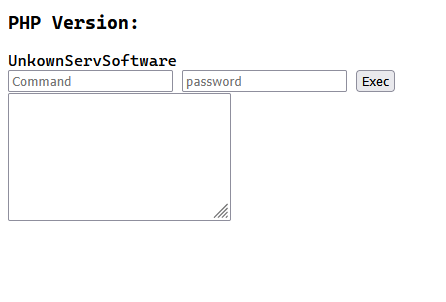

# php-webshell

web shell from php (no fancy reverse shell, just simple stuff: `shell_exec($command)` if `password_verify` returns true)

# Inspiration

- [This is how I create a Simple PHP Web Shell (GPWShell-Proyect) by Carlos Padilla](https://medium.com/@cpadlab/this-is-how-to-create-a-simple-php-web-shell-gpwshell-proyect-aff0106a40e2)
